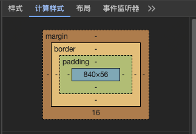

# CSS 盒模型与布局

- 本文系统梳理**CSS**盒模型及盒模型布局
- 详细讲解内容盒模型(`content-box`)与边框盒模型(`border-box`)异同
- 系统讲解`BFC`创建条件及应用
- 系统讲解`flex`布局，详解其相关属性值
- 简单总结`grid`布局及案例，另外通过案例快速了解掌握`table`布局。

## 什么是盒模型？

- 在页面中，每个元素被显示为一个矩形的方框，这就是盒子(`box`)。
- 一个盒子(`box`)从内到外由内容(`content`)、内边距(`padding`)、边框(`border`)和外边距(`margin`)组成，这个组成的方式就是盒模型。

下面是 chrome 浏览器调试工具里展示的布局图，它很直观地展示了一个页面元素的盒模型组成结构。  


## 盒模型类型

`CSS`属性`box-sizing`，它定义了如何计算一个元素盒模型的总宽度和总高度。  
它有两个值：`content-box`(内容盒模型)和`border-box`(边框盒模型)，默认值是 `content-box`(内容盒模型) 。  
主要区别是是否需要加上内边距(`padding`)和边框(`border`)。

> `border-box`(边框盒模型)也叫做怪异盒模型，起源于早期 IE 浏览器的 bug。

### 内容盒模型

```css
box-sizing: content-box;
```

- 该样式元素实际内容区域(`content`)的宽度`width`/高度`height` = 我们设置在这个元素上的宽度`width`/高度`height`
- 该样式元素实际盒模型的总宽度和高度 = `width` / `height` + 对应横纵轴上的 ( 内边距`padding` + 边框`border` + 外边距`margin`)

### 边框盒模型

```css
box-sizing: border-box; // 怪异盒模型
```

- 该样式元素实际内容区域(`content`)的宽度`width`/高度`height` + 对应横纵轴上的 ( 内边距`padding` + 边框`border`) = 我们设置在这个元素上的宽度`width`/高度`height`
- 该样式元素实际盒模型的总宽度和高度 = `width` / `height` + 对应横纵轴上的 ( 外边距`margin`)

## 元素类型 & 布局

`CSS`属性`display`，用来设置元素是否被视为块级(`block`)元素或者内联(`inline`)元素以及用于子元素的布局(`layout`)，例如流式布局、网格布局(`grid`)、弹性布局(`flex`)以及传统的表格布局(`table`)等。

### 块级元素

`display`的值为`block`、`table`或者`list-item`的元素是块级元素(**block level element**)，它们会生成块级盒子(**block level box**)并且参加块级格式化上下文(**Block Formatting Contex** 简称`BFC`)。

块级元素行为如下：

- 元素会在内联的方向上扩展并占据父容器在该方向上的所有可用空间，在绝大数情况下意味着元素会和父容器一样宽，每个元素都会换行。
- 元素上设置的宽度`width`和高度`height`会发挥作用。
- 内边距`padding`、边框`border`和外边距`margin`会将其他元素从当前盒子周围"**推开**"

### 内联元素

`display`的值为`inline`

内联元素行为如下：

- 元素不会产生换行。
- 元素上设置的宽度`width`和高度`height`将不起作用。
- 垂直方向的内边距`padding`、边框`border`和外边距`margin`会被应用，但是不会把其他处于 `inline`状态的元素推开。
- 水平方向的内边距`padding`、边框`border`和外边距`margin`会被应用，且会把其他处于`inline`状态的元素推开。

### 内联块级元素

`display`有一个特殊的值`inline-block`，它在内联`inline`和块`block`之间提供了一个中间状态。（呈现出对外`inline`对内`block`的特性）  
这对于以下情况非常有用: 您不希望一个元素切换到新行，但希望它可以设定宽度和高度，并避免上面看到的重叠。

它的行为如下：

- 元素上设置的宽度`width`和高度`height`会发挥作用。
- 内边距`padding`、边框`border`和外边距`margin`会推开其他元素。

### BFC

`BFC`（**Block Formatting Context**）块级格式化上下文，是 Web 页面中盒模型布局的 CSS 渲染模式，指一个独立的渲染区域或者说是一个隔离的独立容器。

BFC 的创造条件

- 根元素: `<html>`
- 浮动元素: 元素的`float`属性值不是`none`
- 绝对定位元素: 元素的`position`属性值为`absolute`或者`fixed`
- 行内块元素: 元素的`display`属性值为`inline-block`
- 表格中的单元格: 元素的`display`属性值为`table-cell`，HTML 标签中表格单元格`<td>`,`<th>`默认为该值
- 表格标题: 元素的`display`属性值为`table-caption`，HTML 标签中表格标题`<caption>`默认为该值
- 匿名表格单元格元素: 元素的`display`属性值为`table`、`table-row-group`、`table-row`、`table-header-group`、`table-footer-group`（分别是 HTML 标签 `table`、`tbody`、`tr`、`thead`、`tfoot` 的默认属性）或 `inline-table`
- `overflow` 不为 `visible` 的块级元素
- `display` 值为 `flow-root` 的元素
- `contain` 值为 `layout`、`content` 或 `paint` 的元素
- 弹性布局的直接子元素: `display`属性值为`flex`或`inline-flex`元素的直接子元素
- 网格布局的直接子元素: `display`属性值为`grid`或`inline-grid`元素的直接子元素
- 多列容器: 元素的`column-count`或`column-widt`不为`auto`
- `column-span`为`all`的元素始终会创建一个新的`BFC`，即使该元素没有包裹在一个多列容器中（标准变更，Chrome bug）。
